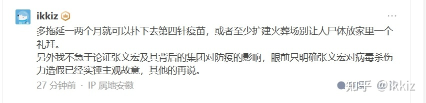
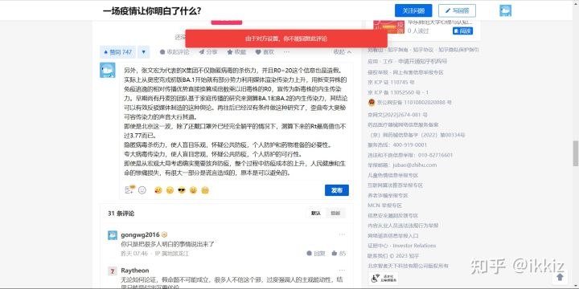
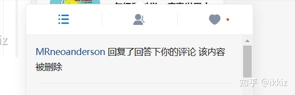
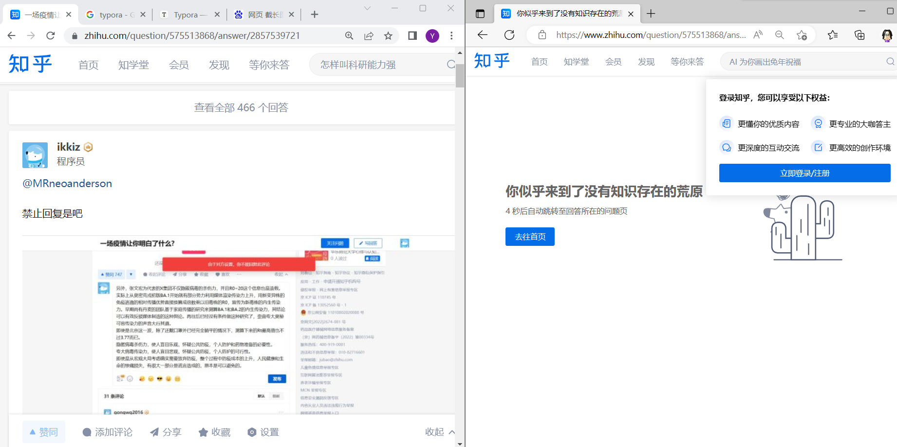

知乎用户MRneoanderson，看来张文宏水军手眼通天啊。

事件记录如下

在知乎用户MRneoanderson的回答下，

一场疫情让你明白了什么? - MRneoanderson的回答 - 知乎
https://www.zhihu.com/question/575513868/answer/2854709748

进行了评论，内容如截图：

仅仅27分钟后，想要接着进行追加评论时，发现被屏蔽。如图：

几分钟后，发现MRneoanderson对我的评论进行了回复，但是内容被系统删除，可能是因为触发了系统的自动审查。

先屏蔽再回复，这应该是想要制造反驳后对方被压倒无法反驳的假象。手段何等肮脏。

我将上述情况记录到回答之后，仅仅几分钟，回答就变成了荒原

看来政治实力强大啊，给你鼓鼓掌。

还是那句话，张文宏故意造假证据确凿，有本事你就洗

https://ikkiz.github.io/video3/